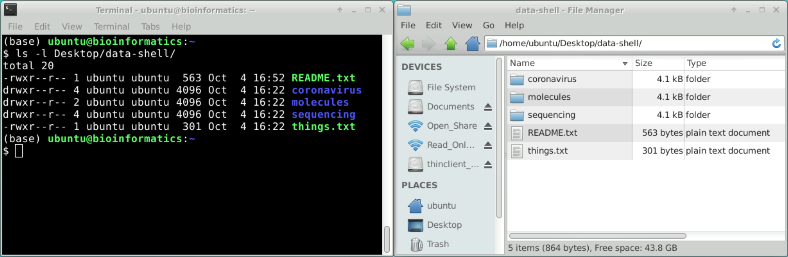

::: {.callout-tip}
## Learning Objectives

- List some advantages of using the Unix command line, compared to graphical user interfaces.
- Run and modify the behaviour of a simple command.

:::


::: {.callout-note}
#### Slides <i class="fa-solid fa-presentation-screen"></i>

This section has an accompanying <a href="https://docs.google.com/presentation/d/1q9Wy77wg_QrN5iP_wYD_TpX7iurs2eFYliOId1owj1A/edit?usp=sharing" target="_blank">slide deck</a>.
:::

## Overview

In these lessons we will give a brief introduction to the Unix Command Line. 
But what is the Command Line?

Humans and computers commonly interact in many different ways, such as through a keyboard and mouse, touch screen interfaces, or using speech recognition systems.
The most widely used way to interact with personal computers is called a **graphical user interface** (GUI).
With a GUI, we give instructions by clicking a mouse and using menu-driven interactions.

While the visual aid of a GUI makes it intuitive to learn, this way of delivering instructions to a computer scales very poorly.
Imagine the following task: for a literature search, you have to extract the author's list contained in the third line of thousands of text files and count how many publications each author has.  
Using a GUI, you would not only be clicking at your desk for several hours, but you could potentially also commit an error in the process of completing this repetitive task.
This is where we take advantage of the Unix shell.

The Unix shell is both a **command-line interface** (CLI) and a **scripting language**, allowing such repetitive tasks to be done automatically and fast. 
With the proper commands, the shell can repeat tasks with or without some modification as many times as we want. 
Using the shell, the task in the literature example can be accomplished in seconds.  
See more motivating examples in the following article: [Five reasons why researchers should learn to love the command line](https://doi.org/10.1038/d41586-021-00263-0).

{#fig-gui-cli fig-alt="Screenshots of a terminal and the file explorer both displaying the same files and folders on an example directory"}


## The Shell

The shell is a program where users can type commands.
With the shell, it's possible to invoke complicated programs like bioinformatics software or simple commands that create an empty directory, with only one line of code.
The most popular Unix shell is **_Bash_**.
_Bash_ is the default shell on most modern implementations of Unix and in most packages that provide Unix-like tools for Windows.

Using the shell will take some effort and some time to learn.
While a GUI presents you with choices to select, CLI choices are not automatically presented to you, so you must learn a few commands like new vocabulary in a language you're studying.

The grammar of a shell allows you to combine existing tools into powerful pipelines and handle large volumes of data automatically. 
Sequences of commands can be written into a _script_, improving the reproducibility of workflows.

In addition, the command line is often the easiest way to interact with remote machines and supercomputers.
Familiarity with the shell is near essential to run a variety of specialized tools and resources including high-performance computing systems.
As clusters and cloud computing systems become more popular for scientific data processing, being able to interact with the shell is becoming a necessary skill.

::: {.callout-tip collapse=true}
#### Nomenclature: Unix, Linux, Shell, Terminal, Command Line

Often, people interchangeably use terms like “shell”, “command line”, “bash” and “terminal” to mean broadly the same thing: 
**a (non-Windows) command line**.

Here is a brief explanation of what these terms mean:

- Terminal -- is a program that allows us to interact with the computer using text-based commands (i.e. a command line interface).
- Unix Shell -- the command-line interpreter that allows you to interact with the Unix-like operating system. 
  Another example of a command-line interpreter is the [Windows Command Prompt](https://en.wikipedia.org/wiki/Cmd.exe).
- Bash -- is both a _programming language_ to work on the Unix shell and an _interpreter_ for shell scripts (similarly to how _Python_ is both a language specification, but also has the `python` program that can be used to run _Python_ scripts).
  There are alternative Unix shell implementations, such as the [_Z shell_](https://en.wikipedia.org/wiki/Z_shell) (but they share similarities to _Bash_).

You may have also heard the terms “Unix”, “Linux” and “Ubuntu” used interchangeably:

- Unix -- is a family of operating systems, which includes _Linux_ and _Mac OS_, and which share a particular architecture.
- Linux -- is a (sub-)family of operating systems built on an open-source core.
- Ubuntu -- is a particular distribution (or "flavour") of the _Linux_ operating system. 
  Other popular examples include [_Gnome_](https://en.wikipedia.org/wiki/GNOME) and [_centOS_](https://en.wikipedia.org/wiki/CentOS). 
  They are equivalent when it comes to the command-line usage.

:::


## Running Commands

When the shell is first opened, you are presented with a **prompt**, indicating that the shell is waiting for input.
A typical prompt on Linux may look like this: 

```bash
username@machine:~$
```

It shows your username, the name of the computer, the location in the filesystem where you are at the moment (more on this later) and the `$ `, after which you have a blinking cursor waiting for input. 
After you type a command, you have to press the <kbd>Enter ↲</kbd> key to execute it.

So let's try our first command, `ls` which is short for "listing".
This command will list the contents of the current directory:

```bash
ls
```

```
Documents    Downloads    Music        Public
Desktop      Movies       Pictures     Templates
```

Your results may be slightly different, depending on your operating system and how you have customized your filesystem.

::: {.callout-warning}
#### Command not found

If the shell can't find a program whose name is the command you typed, it will print an error message such as:

```bash
ks
```

```
ks: command not found
```

This might happen if the command was mis-typed or if the program corresponding to that command is not installed.
:::


## Command Options

{fig-alt="Image of a typical Shell command also detailed in the main text"}

Commands can often change their behaviour with additional options.
Consider the command below as a general example, which we will dissect into its component parts:

```bash
ls -l --sort time Desktop/data-shell
```

- `ls` is the **command**.
- `-l` is an **argument** that "switches on" a particular behaviour of the program. 
  In this case it lists the files in a "long" format.
  These kind of arguments are also also called an **option**, **switch** or **flag**. 
  Options either start with a single dash (`-`) or two dashes (`--`).
- `--sort` is also argument, but it needs a value to indicate how it should change the behaviour of the program. 
  In this case, the option changes how the files are sorted (in our example we specified 'time' to sort files by the time they were created or modified).
- `Desktop/data-shell` is a **positional argument**, which comes at the end of the command. 
  This argument tells the command what to operate on (e.g. files and directories). 

A command can be called with more than one option and more than one argument: but a command doesn't always require an argument or an option.

Each part is separated by spaces: if you omit the space between `ls` and `-l` the shell will look for a command called `ls-l`, which doesn't exist. 
Also, capitalisation can be important: `ls -r` is different to `ls -R`.

So, our command above gives us a _long listing_ of files and directories in the directory `Desktop/data-shell`. 


## Getting help

`ls` has lots of other **options**. There are two common ways to find out how to use a command and what options it accepts:

1. We can pass a `--help` option to the command, such as `ls --help`.
2. We can read its manual with `man`, such as `man ls`.  
  To exit the `man` page you can type <kbd>Q</kbd> (for "quit").

::: {.callout-note}
#### Manual page

The `man` page is not available for every software. 
For example, specialist software (such as bioinformatics packages) only have the documentation available through the `--help` option. 
:::

Unfortunately, tool documentation is not completely standardised. 
However, there are some common patterns, which we highlight here.  
Take the documentation of this (imaginary) software as an example:

```default
Bioinfomagic is a tool that magically guesses what you want to do with your raw data.

Usage: 
 bioinfomagic [options] -o <dir> <file1> … <fileN>

Arguments (mandatory): 
 -o, --output=PATH  The path to the results 
                    directory

Options:
 -t, --threads=N    The number of CPUs to use.
 --submit           Automatically write and submit 
                    a manuscript.
 --help             Print this help message and 
                    exit.
```

- Often the `--help` page starts with a short description of the software.
- Then there's a _usage_ example, to give us an idea of how the tool should be run. 
  In this example note that `<` and `>` are used to indicate _user input_. 
  These should not be included in our command. 
  For example, if we wanted our output to be in a directory called `results`:
  - Correct: `-o results`
  - Wrong: `-o <results>`
- This tool can take an arbitrary number of input files, but they have to be at the end of the command. 
  For example:
  - Correct: `bioinfomagic -o results file1.txt file2.txt`
  - Wrong: `bioinfomagic file1.txt file2.txt -o results`
- In this case `[options]` indicates that we can add additional arguments to the command (which are listed further down the help). 
  The order of these named arguments doesn't matter, for example: 
  - Correct: `bioinfomagic --submit -o results file1.txt file2.txt`
  - Correct: `bioinfomagic -o results --submit file1.txt file2.txt`
  - Wrong: `bioinfomagic -o results file1.txt file2.txt --submit` (the input files should be at the end)
- Long and short argument names are equivalent, for example: `-o results` is the same as `--output=results`

This is one example of how the documentation may look like but, as we mentioned above, this is not always standard. 
Here is another way in which the usage could have been specified: 

```default
bioinfomagic --output STR [--submit] [--threads INT] FILE1 [...] [FILEN]
```

In this case, optional arguments are shown within `[]` (but the `[` and `]` should not be included in our final command). 
Also, the values for the options are indicated as: `STR`, which means "string" (textual input);`INT` (an integer, or whole number). 


:::{.callout-note}
#### macOS vs Linux

Although macOS has a Unix terminal, it uses a different set of tools from Linux distributions. 
macOS is based on FreeBSD, whereas Linux comes with GNU utilities.  

Most of the commands work very similarly across both, but you may come across some minor differences. 
For example, the `ls` command on macOS does not have the option `--sort` or `--help`. 
However, the macOS `ls` command does have options to change how it sorts files, and you can look at the manual page `man ls` to see how. 
:::


## Summary

:::highlight

**Key Points**

- The Unix shell (command line) allows running complex operations with a few commands, interact with high-performance computing servers and write reproducible analysis in scripts.
- The basic syntax of a command is: `command -options argument`.  
  For example, `ls -l Documents` would **l**ist the contents of the `Documents` directory in a **l**ong format.
- To find the options available with a given program we can use the `--help` function or (in some cases) the `man` command.  
  For example: `ls --help` or `man ls`.

:::


