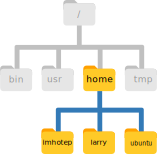

::: {.callout-tip}
## Learning Objectives

- Understand the hierarchical structure of filesystems and how the location of files and directories is specified.
- Recognise when `/` is used to specify the root directory or to separate directories.
- Navigate the filesystem using the commands `pwd`, `ls` and `cd`.
- Create, move, copy and remove files and directories using the commands `mkdir`, `rmdir`, `rm`, `cp` and `mv`.

:::


## Working Directory

The part of the operating system responsible for managing files and directories is called the **filesystem**. 
It organizes our data into **files**, which hold information, and **directories** (also called **folders**), which hold files or other directories.  
These directories are orgainsed in a hierarchical way, which we can represent as a tree. 
Take the following image as an example: 

{fig-alt="Diagram of a filesystem representing three users' home folders as a tree-like diagram starting from the root `/` of the filesystem, then to a folder called `home` and finally three folders called `larry`, `imhotep` and `ubuntu`."}

This is illustrating the location of the home directories for three users called "larry", "imhotep" and "ubuntu". 
We can see that each of their home directories is within another directory called `home`. 
And finally, the `home` directory is located in the so-called _root of the filesystem_, represented by a `/` slash.
The root is the top-most directory where everything for our operating system is stored in (it's not possible to go "above" this special root directory). 

When we use the shell, we need to specify the location of files and directories using an "address" (similarly to how you specify an internet address to reach a given website). 
Let's explore this from our shell terminal.  
First let's find out where we are by running a command called `pwd` (which stands for "print working directory"). 
Directories are like *places* - at any time while we are using the shell we are in exactly one place, called our **current working directory**. 
Commands mostly read and write files in the current working directory, so knowing where you are before running a command is important. 

```bash
$ pwd
```

```
/home/ubuntu
```

Here, the computer's response is `/home/ubuntu`, which is our **home directory**, the default when opening a new shell terminal. 
The name "ubuntu" is our _username_.  
If the user *imhotep* was logged in, they would see `/home/imhotep` as their default working directory. 

Notice how the location of this folder is specified: 

- `/` at the start specifies the _root of the filesystem_.
- `home` specifies the folder "home" within the root.
- `/` is a _separator_ between the "home" folder and the next folder.
- `ubuntu` is the final folder specifying this location. 

This way of representing file or directory locations is called a **path**. 

::: {.callout-important}
#### The `/` Slash

Notice that there are two meanings for the `/` character. 
When it appears at the beginning of a file or directory name, it refers to the root directory. 
When it appears *inside* a name, it's a separator.
:::

::: {.callout-note}
#### Home Directory Variation

The home directory path will look different on different operating systems. 
For a user named "larry", on a Mac it would look like `/Users/larry`, and on Windows `C:\Users\larry`.
:::


## Listing Files

We can see the content of our current directory by running `ls`, which stands for "listing":

```bash
$ ls
```

```
Documents    Downloads    Music        Public
Desktop      Movies       Pictures     Templates
```

The `/home/ubuntu/` directory contains many familiar folders that are typical of a user's home. 

The data for this workshop is located in our Desktop, within a directory called `data-shell`. 
We can look at its contents passing a directory name as an argument to ls:

```bash
$ ls -F /home/ubuntu/Desktop/data-shell
```

```
README.txt  coronavirus/  molecules/  sequencing/  things.txt
```


## Changing Directory

So far, we have been working from `/home/ubuntu/`. 
However, we can change our location to the `Desktop/data-shell` directory to do our work.

The command to change locations is `cd` ("change directory") followed by a directory name to change our working directory. 

```bash
$ cd /home/ubuntu/Desktop/data-shell/
```

We can check with `pwd` that we are in the correct directory.
We can also run `ls` again to see the files within our current directory.

What if we now wanted to go to the `molecules` directory? 
We could do:

```bash
$ cd /home/ubuntu/Desktop/data-shell/molecules/
```

However, that's a lot of typing!
Instead, we can move to that directory by specifying its location _relative_ to our current directory. 
So, if our current directory was `/home/ubuntu/Desktop/data-shell/` we could just do:

```bash
$ cd molecules
```

In conclusion, there are two ways to specify directory names:

- An **absolute path** includes the entire path (or location) from the root directory, which is indicated by a leading slash. 
  The leading `/` tells the computer to follow the path from the root of the file system, so it always refers to exactly one directory, no matter where we are when we run the command.
- A **relative path** tries to find that location from where we are (our current directory), rather than from the root of the file system.

We now know how to go _down_ the directory tree, but how do we go _up_? 
We might try the following:

```bash
$ cd data-shell
```

```
-bash: cd: data-shell: No such file or directory
```

But we get an error! Why is this?
With our methods so far, `cd` can only see sub-directories _inside_ your current directory. 
To move up one directory we need to use the special shortcut `..` like this:

```bash
$ cd ..
```

`..` is a special directory name meaning "the directory containing this one", or more succinctly, the **parent** of the current directory. 
Sure enough, if we run `pwd` after running `cd ..`, we're back in `/home/ubuntu/Desktop/data-shell`.


::: {.callout-note}
#### The `~` Home Shortcut

The shell interprets the character `~` (tilde) at the start of a path to mean "the user's home directory". 
In our example the `~` is equivalent to `/home/ubuntu`. 
:::


::: {.callout-note}
#### Tab Completion

Sometimes file and directory names get too long and it's tedious to have to type the full name, for example when moving with `cd`.  
We can let the shell do most of the work through what is called **tab completion**. 
Let's say we are in the `/home/ubuntu/Desktop/data-shell` and we type:

```bash
$ ls mol
```

and then press the <kbd>Tab ↹</kbd> key on the keyboard, the shell automatically completes the directory name:

```bash
$ ls molecules/
```

If we press <kbd>Tab ↹</kbd> again it does nothing, since there are now multiple possibilities.
In this case, quickly pressing <kbd>Tab ↹</kbd> twice brings up a list of all the files. 
:::


## Creating directories

We now know how to explore files and directories, but how do we create them in the first place?  
First, we should see where we are and what we already have.
Let's go back to our `data-shell` directory and use `ls` to see what it contains:

```bash
$ cd ~/Desktop/data-shell
$ ls
```

```
README.txt  coronavirus  molecules  sequencing
```

Now, let's **create a new directory** called `thesis_notes` using the command `mkdir` ("make directory"):

```bash
$ mkdir thesis_notes
```

The new directory is created in the current working directory:

```bash
$ ls
```

```bash
README.txt  coronavirus  molecules  sequencing  thesis_notes  things.txt
```

Note that using the shell to create a directory is no different than using a file explorer. 
If you open the current directory using your operating system's graphical file explorer <i class="fa-solid fa-folder"></i>, the `results` directory will appear there too.  
While the shell and the file explorer are two different ways of interacting with the files, the files and directories themselves are the same.

::: {.callout-note collapse=true}
#### Good Naming Conventions - click here for some tips

Complicated names of files and directories can make your life painful when working on the command line.  
Here are some useful tips for naming your files:

1. Don't use spaces.  
   Spaces can make a name more meaningful, but since spaces are used to separate arguments on the command line it is better to avoid them in names of files and directories.
   You can use `-` or `_` instead (e.g. `thesis_notes/` rather than `thesis notes/`).
2. Don't begin the name with `-` (dash).  
   Commands treat names starting with `-` as options.
3. Only use letters, numbers, `.` period, `-` hyphen and `_` underscore.  
   Many other characters (such as `!`, `@`, `$`, `"`, etc.) have special meanings on the command line and can cause your command to not work as expected or even lead to data loss.

If you need to refer to names of files or directories that have spaces or other special characters, you should surround the name in quotes (`""`).
:::

::: {.callout-note}
#### What's in a file name?

You may have noticed that all of the files in our data directory are named "something dot something". 
For example `README.txt`, which indicates this is a plain text file. 

The second part of such a name is called the **filename extension**, and indicates what type of data the file holds. 
Here are some common examples:

- `.txt` is a plain text file.
- `.csv` is a text file with tabular data where each column is separated by a comma. 
- `.tsv` is like a CSV but values are separated by a tab.
- `.log` is a text file containing messages produced by a software while it runs.
- `.pdf` indicates a PDF document.
- `.png` is a PNG image.

This is just a convention: we can call a file `mydocument` or almost anything else we want. 
However, most people use two-part names most of the time to help them (and their programs) tell different kinds of files apart. 

This is just a convention, albeit an important one. 
Files contain bytes: it's up to us and our programs to interpret those bytes according to the rules for plain text files, PDF documents, configuration
files, images, and so on.

Naming a PNG image of a whale as `whale.mp3` doesn't somehow magically turn it into a recording of whalesong, though it *might* cause the operating system to try to open it with a music player when someone double-clicks it.
:::


## Moving & Renaming

In our `data-shell` directory we have a file called `things.txt`, which contains a note of books to read for our thesis. 
Let's move this file to the `thesis_notes` directory we created earlier, using the command `mv` ("move"):

```bash
$ mv things.txt thesis_notes/
```

The first argument tells `mv` what we're "moving", while the second is where it's to go. 
In this case, we're moving `things.txt` to `thesis_notes/`. 
We can check the file has moved there:

```bash
$ ls thesis_notes
```

```
things.txt
```

This isn't a particularly informative name for our file, so let's change it!
Interestingly, we also use the `mv` command to change a file's name.  
Here's how we would do it:

```bash
$ mv thesis_notes/things.txt thesis_notes/books.txt
```

In this case, we are "moving" the file to the same place but with a different name.
Be careful when specifying the target file name, since `mv` will silently overwrite any existing file with the same name, which could lead to data loss. 

The command `mv` also works with directories, and you can use it to move/rename an entire directory just as you use it to move an individual file.


## Copying Files and Directories

The `cp` command works very much like `mv`, except it copies a file instead of moving it.
For example, let's make a copy of our `books.txt` file:

```bash
$ cp thesis_notes/books.txt books_copy.txt
$ ls
```

```
README.txt  books_copy.txt  coronavirus  molecules  sequencing  thesis_notes
```

Unlike the `mv` command, in this case the original file remains in the original directory: 

```bash
$ ls thesis_notes/
```

```
books.txt
```


## Removing Files and Directories

The Unix command used to remove or delete files is `rm` ("remove"). 
For example, let's remove one of the files we copied earlier: 

```bash
$ rm backup/cubane.pdb
```

We can confirm the file is gone using `ls backup/`.

What if we try to remove the whole `backup` directory we created in the previous exercise?

```bash
$ rm backup
```

```
rm: cannot remove `backup': Is a directory
```

We get an error. 
This happens, because `rm` _by default_ only works on files, not directories.

`rm` can remove a directory *and all its contents* if we use the recursive option `-r`, and it will do so *without any confirmation prompts*:

```bash
$ rm -r backup
```

Given that there is no way to retrieve files deleted using the shell, **`rm -r` should be used with great caution** (you might consider adding the interactive option `rm -r -i`).

To remove _empty_ directories, we can also use the `rmdir` command. 
This is a safer option than `rm -r`, because it will never delete the directory if it contains files, giving us a chance to check whether we really want to delete all its contents.

::: {.callout-warning}
#### Deleting Is Forever

The Unix shell doesn't have a trash bin that we can recover deleted files from (though most graphical interfaces to Unix do).  
Instead, when we delete files, they are unlinked from the file system so that their storage space on disk can be recycled. 
Tools for finding and recovering deleted files do exist, but there's no guarantee they'll work in any particular situation, since the computer may recycle the file's disk space right away.
:::


## Wildcards

Wildcards are special characters that can be used to access multiple files at once. 
The most commonly-used wildcard is `*`, which is used to match zero or more characters. 

Consider these examples referring to files in the `molecules` directory: 

- `*.pdb` matches every file that ends with '.pdb' extension.
- `p*.pdb` only matches `pentane.pdb` and `propane.pdb`, because the 'p' at the front only matches filenames that begin with the letter 'p'.

Another common wildcard is `?`, which matches any character _exactly once_.
For example:

- `?ethane.pdb` would only match `methane.pdb` (whereas `*ethane.pdb` matches both `ethane.pdb`, and `methane.pdb`).
- `???ane.pdb` matches three characters followed by `ane.pdb`, giving `cubane.pdb  ethane.pdb  octane.pdb`.

When the shell sees a wildcard, it expands the wildcard to create a list of matching filenames *before* running the command that was asked for. 
As an exception, if a wildcard expression does not match any file, _Bash_ will pass the expression as an argument to the command as it is.  
For example typing `ls *.pdf` in the `molecules` directory (which does not contain any PDF files) results in an error message that there is no file called `*.pdf`. 


## Finding Files

Often, it's useful to be able to find files that have a particular pattern in their name. 
We can use the `find` command to achive this. 
Here is an example, where we try to find all the CSV files that exist under our `data-shell` folder: 

```bash
find . -type f -name "*.csv"
```

```
./coronavirus/variants/india_variants.csv
./coronavirus/variants/ireland_variants.csv
./coronavirus/variants/southafrica_variants.csv
./coronavirus/variants/switzerland_variants.csv
./coronavirus/variants/uk_variants.csv
```

In this case, we used the option `-type f` to only find **f**iles with the given name. 
We could use the option `-type d` if we wanted to instead find **d**irectories only. 
If we wanted to find both files and directories, then we can omit this option.

The `find` command has many more options to configure the search results (you can check these with `man find`). 
One option that can sometimes be useful is to find AND delete all the files.
For example the following command would delete all files with `.txt` extension: 

```bash
find . -type f -name "*.txt" -delete
```

As you can imagine, this feature is **very useful but also potentially dangerous** as you may accidentally delete files you didn't intend to ("with great power comes great responsibility", as they say <i class="fa-solid fa-spider"></i>). 
So, always make sure to run the command _without the `-delete` option first_ to check that only the files you really want to delete are being matched. 


## Exercises

:::{.callout-exercise}
#### Navigating the filesystem


Using the filesystem diagram below, if `pwd` displays `/Users/Robin/Documents/`, what will `ls ../backup` display?

1. `../backup: No such file or directory`
2. `2012-12-01 2013-01-08 2013-01-27`
3. `original pnas_final pnas_sub`


::: {.callout-answer collapse=true}

1. No: from the diagram, we can see that there *is* a directory `backup` in `/Users/Robin/`.
2. No: this is the content of `Users/Robin/Documents/backup/`, but with `..` we asked for one level _up_.
3. **Yes:** `../backup/` refers to `/Users/Robin/backup`.
:::
:::


:::{.callout-exercise}
#### File paths


Starting from `/home/amanda/data`, which of the following commands could Amanda use to navigate to her home directory (`/home/amanda`)?

1. `cd .`
2. `cd /`
3. `cd /home/amanda`
4. `cd ../..`
5. `cd ~`
6. `cd home`
7. `cd ~/data/..`
8. `cd`
9. `cd ..`

::: {.callout-answer collapse=true}

1. No: `.` stands for the current directory.
2. No: `/` stands for the root directory.
3. **Yes**: This is an example of using the full absolute path.
4. No: this goes up two levels, i.e. ends in `/home`.
5. **Yes**: `~` stands for the user's home directory, in this case `/home/amanda`.
6. No: this would navigate into a directory `home` in the current directory if it exists.
7. **Yes**: unnecessarily complicated, but correct.
8. **Yes**: shortcut to go back to the user's home directory.
9. **Yes**: goes up one level.
:::
:::


:::{.callout-exercise}
#### Renaming files


Suppose that you created a plain-text file in your current directory to contain a list of the statistical tests you will need to do to analyze your data, and named it `statstics.txt`.

After creating and saving this file you realize you misspelled the filename! 
You want to correct the mistake, which command could you use to do so?

1. `cp statstics.txt statistics.txt`
2. `mv statstics.txt statistics.txt`
3. `mv statstics.txt .`
4. `cp statstics.txt .`

::: {.callout-answer collapse=true}

1. No.  While this would create a file with the correct name, the incorrectly named file still exists in the directory
and would need to be deleted.
2. **Yes**, this would work to rename the file.
3. No, the period(.) indicates where to move the file, but does not provide a new file name; identical file names
cannot be created.
4. No, the period(.) indicates where to copy the file, but does not provide a new file name; identical file names
cannot be created.
:::
:::


:::{.callout-exercise}
#### Copy directories


Make a copy of the `sequencing` directory named `backup`.
When copying an entire directory, you will need to use the option `-r` with the `cp` command (`-r` means "recursive"). 

::: {.callout-answer collapse=true}

If we run the command without the `-r` option, this is what happens:

```bash
$ cp sequencing backup
```

```
cp: -r not specified; omitting directory 'sequencing'
```

This message is already indicating what the problem is.
By default, directories (and their contents) are not copied unless we specify the option `-r`.

This would work:

```bash
$ cp -r sequencing backup
```

Running `ls` we can see a new folder called `backup`:

```bash
$ ls
```

```
README.txt  backup  books_copy.txt  coronavirus  molecules  sequencing  thesis_notes
```
:::
:::


:::{.callout-exercise}
#### Wildcards


When run in the `molecules` directory, which `ls` command(s) will produce this output?

```
ethane.pdb   methane.pdb
```

1. `ls *t*ane.pdb`
2. `ls *t?ne.*`
3. `ls *t??ne.pdb`
4. `ls ethane.*`

::: {.callout-answer collapse=true}

1. No. This shows all files whose names contain zero or more characters (`*`) followed by the letter `t`, then zero or more characters (`*`) followed by `ane.pdb`.  
   This gives `ethane.pdb  methane.pdb  octane.pdb  pentane.pdb`. 
2. No. This shows all files whose names start with zero or more characters (`*`) followed by the letter `t`, then a single character (`?`), then `ne.` followed by zero or more characters (`*`).  
   This will give us `octane.pdb` and `pentane.pdb` but doesn't match anything which ends in `thane.pdb`.
3. **Yes**. This fixes the problems of option 2 by matching two characters (`??`) between `t` and `ne`. 
4. No. This only shows files starting with `ethane.`.
:::
:::


:::{.callout-exercise}
#### Copy with multiple filenames


What does `cp` do when given several filenames and a directory name?

```bash
$ mkdir -p backup
$ cp molecules/cubane.pdb molecules/ethane.pdb backup/
```

In the example below, what does `cp` do when given three or more file names?

```bash
$ cp molecules/cubane.pdb molecules/ethane.pdb molecules/methane.pdb
```


::: {.callout-answer collapse=true}

If given more than one file name followed by a directory name (i.e. the destination directory must be the last argument), `cp` copies the files to the named directory.

If given three file names, `cp` throws an error such as the one below, because it is expecting a directory name as the last argument.

```bash
cp: target 'molecules/methane.pdb' is not a directory
```
:::
:::


## Summary

::: {.callout-tip}
#### Key Points

- The file system is organised in a hierarchical way.
- Every user has a home directory, which on Linux is `/home/username/`.
- Locations in the filesystem are represented by a **path**:
  - The `/` used at the _start_ of a path means the "root" directory (the start of the filesystem). 
  - `/` used in the _middle_ of the path separates different directories. 
- Some of the commands used to navigate the filesystem are:
  - `pwd` to print the working directory (or the current directory)
  - `ls` to list files and directories
  - `cd` to change directory
- Directories can be created with the `mkdir` command.
- Files can be moved and/or renamed using the `mv` command.
- Files can be copied with the `cp` command. To copy an entire directory (and its contents) we need to use `cp -r` (the `-r` option will copy files **r**ecursively).
- Files can be removed with the `rm` command. To remove an entire directory (and its contents) we need to use `rm -r`  (the `-r` option will remove files **r**ecursively).
  - Deleting files from the command line is _permanent_.
- We can operate on multiple files using the `*` wildcard, which matches "zero or more characters". For example `ls *.txt` would list all files that have a `.txt` file extension.
- The `find` command can be used to find the location of files matching a specific name pattern.
:::

