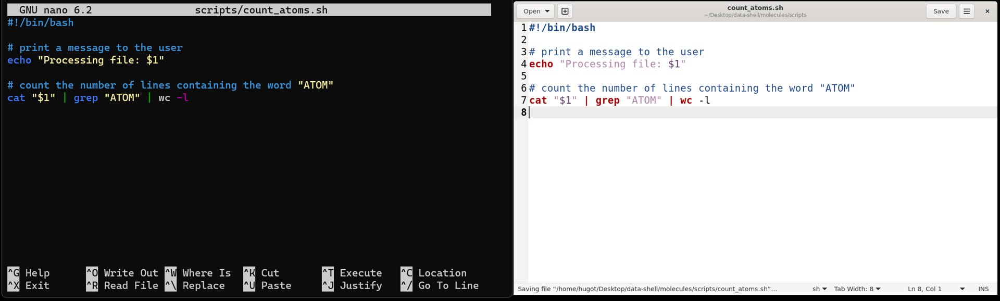

::: {.callout-tip}
## Learning Objectives

- Create files from the command line using a text editor.
- Write a shell script that runs a command or series of commands for a fixed set of files.
- Run a shell script from the command line.

:::

## Shell Scripts

So far, we have been running commands directly on the console in an interactive way. 
However, to re-run a series of commands (or an analysis), we can save the commands in a file and execute all those operations again later by typing a single command. 
The file containing the commands is usually called a **shell script** (you can think of them as small programs).

For example, let's create a shell script that counts the number of atoms in one of our molecule files (in the `molecules` directory):
We could achieve this with the following command: 

```bash
$ cat cubane.pdb | grep "ATOM" | wc -l
```

To write a shell script we have to save this command within a text file. 
But first we need to see how we can create a text file from within the command line.


## Editing Files

There are many text editors available for programming, but we will cover two simple ones that can be called from the command line: `nano`, which is purely based on the terminal; and `gedit`, which has a graphical user interface.  
First let's create a directory to save our scripts:

```bash
$ mkdir scripts/
```

We can create a file with _Nano_ in the following way:

```bash
$ nano scripts/count_atoms.sh
```

This opens a text editor, where you can type the commands you want to save in the file. 
Once we're happy with our text, we can press <kbd>Ctrl</kbd>+<kbd>X</kbd> to exit the program.  
As we have made changes to the file, we will be asked the following:

```
Save modified buffer?
 Y Yes
 N No    ^C Cancel
```

That's a slightly strange way that `nano` has of asking if we want to save the file. 
We can press <kbd>Y</kbd> and then we're asked to confirm the file name. 
At this point we can press <kbd>Enter ↵</kbd> and this will exit _Nano_ and take us back to the console.  
We can check with `ls scripts/` that our new file is there. 

Note that because we saved our file with `.sh` extension (the conventional extension used for shell scripts), _Nano_ does some colouring of our commands (this is called _syntax highlighting_) to make it easier to read the code. 

{fig.alt="Two screenshots of these programs side-by-side, displaying the code described in the text."}

Alternatively, you can use the `gedit` text editor, which is a little more user-friendly. 
The command to open a script is: `gedit scripts/count_atoms.sh`. 
This opens the text editor in a separate window, which has the advantage that you can work on the script while having the terminal open.  
You can save the file using <kbd>Ctrl</kbd>+<kbd>S</kbd>. Remember to save your files regularly as you work on them.


::: {.callout-note}
#### Text Editors

When we say, "`nano` and `gedit` are text editors", we really do mean "text": they only work with plain character data, not tables, images, or any other human-friendly media. 
We use it in examples because it is one of the least complex text editors. 
However, because of this trait, it may not be powerful enough or flexible enough for the work you need to do after this workshop. 

On Unix systems (such as Linux and Mac OS X), many programmers use [Emacs](http://www.gnu.org/software/emacs/) or [Vim](http://www.vim.org/). 
Both of these run from the terminal and have very advanced features, but require more time to learn. 

Alternatively, programmers also use graphical editors, such as [Visual Studio Code](https://code.visualstudio.com/).
This software offers many advanced capabilities and extensions and works on Windows, Mac OS and Linux. 
:::


## Running Scripts

Now that we have our script, we can run it using the program `bash`:

```bash
$ bash scripts/count_atoms.sh
```

```
16
```

Which will print the result of running those commands on our screen. 
In summary, running a shell script is exactly the same as running the commands one-by-one on the shell.  
However, saving our commands in a script has some advantages: it serves as a **record** of our analysis, making it more **reproducible** and it allows us to **adapt and reuse** our code to run other similar analysis. 


## Summary 

{fig-alt="Diagram summarising how a shell script is organised, including the shebang, comments and code."}

::: {.callout-tip}
#### Key Points

- The `nano` text editor can be used to create or edit files from the command line. 
  - The `gedit` text editor is a graphical alternative available on most Linux distributions. 
  - A recommended graphical text editor availabe on all major operating systems is [Visual Studio Code](https://code.visualstudio.com/).
- We can save commands in a text file, which we call a _shell script_. Shell scripts have extension `.sh`.
- Shell scripts can be executed using the program `bash`. 
:::
