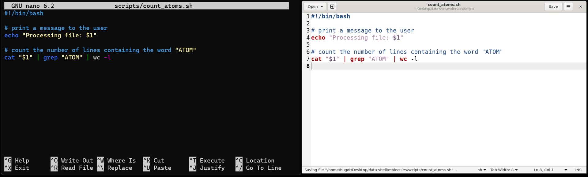

::: {.callout-tip}
## Learning Objectives

- Create files from the command line using a text editor.
- Write a shell script that runs a command or series of commands for a fixed set of files.
- Run a shell script from the command line.
- Customise shell scripts to work with inputs defined by the user. 
- Define _Bash_ variables based on commands. 

:::

## Shell Scripts

So far, we have been running commands directly on the console in an interactive way. 
However, to re-run a series of commands (or an analysis), we can save the commands in a file and execute all those operations again later by typing a single command. 
The file containing the commands is usually called a **shell script** (you can think of them as small programs).

For example, let's create a shell script that counts the number of atoms in one of our molecule files (in the `molecules` directory):
We could achieve this with the following command: 

```bash
$ cat cubane.pdb | grep "ATOM" | wc -l
```

To write a shell script we have to save this command within a text file. 
But first we need to see how we can create a text file from within the command line.


## Editing Files

There are many text editors available for programming, but we will cover two simple ones that can be called from the command line: `nano`, which is purely based on the terminal; and `gedit`, which has a graphical user interface.  
First let's create a directory to save our scripts:

```bash
$ mkdir scripts/
```

We can create a file with _Nano_ in the following way:

```bash
$ nano scripts/count_atoms.sh
```

This opens a text editor, where you can type the commands you want to save in the file. 
Once we're happy with our text, we can press <kbd>Ctrl</kbd>+<kbd>X</kbd> to exit the program.  
As we have made changes to the file, we will be asked the following:

```
Save modified buffer?
 Y Yes
 N No    ^C Cancel
```

That's a slightly strange way that `nano` has of asking if we want to save the file. 
We can press <kbd>Y</kbd> and then we're asked to confirm the file name. 
At this point we can press <kbd>Enter ↵</kbd> and this will exit _Nano_ and take us back to the console.  
We can check with `ls scripts/` that our new file is there. 

Note that because we saved our file with `.sh` extension (the conventional extension used for shell scripts), _Nano_ does some colouring of our commands (this is called _syntax highlighting_) to make it easier to read the code. 

{fig.alt="Two screenshots of these programs side-by-side, displaying the code described in the text."}

Alternatively, you can use the `gedit` text editor, which is a little more user-friendly. 
The command to open a script is: `gedit scripts/count_atoms.sh`. 
This opens the text editor in a separate window, which has the advantage that you can work on the script while having the terminal open.  
You can save the file using <kbd>Ctrl</kbd>+<kbd>S</kbd>. Remember to save your files regularly as you work on them.


::: {.callout-note}
#### Text Editors

When we say, "`nano` and `gedit` are text editors", we really do mean "text": they only work with plain character data, not tables, images, or any other human-friendly media. 
We use it in examples because it is one of the least complex text editors. 
However, because of this trait, it may not be powerful enough or flexible enough for the work you need to do after this workshop. 

On Unix systems (such as Linux and Mac OS X), many programmers use [Emacs](http://www.gnu.org/software/emacs/) or [Vim](http://www.vim.org/). 
Both of these run from the terminal and have very advanced features, but require more time to learn. 

Alternatively, programmers also use graphical editors, such as [Visual Studio Code](https://code.visualstudio.com/).
This software offers many advanced capabilities and extensions and works on Windows, Mac OS and Linux. 
:::


## Running Scripts

Now that we have our script, we can run it using the program `bash`:

```bash
$ bash scripts/count_atoms.sh
```

```
16
```

Which will print the result of running those commands on our screen. 
In summary, running a shell script is exactly the same as running the commands one-by-one on the shell.  
However, saving our commands in a script has some advantages: it serves as a **record** of our analysis, making it more **reproducible** and it allows us to **adapt and reuse** our code to run other similar analysis. 


## Customising Scripts

The script we wrote so far works on a specific PDB file (in our example `cubane.pdb`). 
But what if we wanted to give it as input a file of our choice? 
We can make our script more versatile by using a special _shell variable_ that means "the first argument on the command line".
Here is our modified script:

```bash
#!/bin/bash

# print a message to the user
echo "Processing file: $1"

# count the number of lines containing the word "ATOM"
cat "$1" | grep "ATOM" | wc -l
```

There are several ways in which we have modified our script: 

- We started the script with a special `#!/bin/bash` line, which is known as a [**shebang**](https://en.wikipedia.org/wiki/Shebang_(Unix)). 
  The _shebang_ is optional, but in some cases is used to inform that this script should use the program `bash` to be executed.
- We have other lines starting with the `#` hash character. 
  These are known as **comments** and are not executed by `bash` (they are ignored). 
  Comments are extremely useful because they allow us to annotate our code with information about the commands we're executing. 
- We used a special variable called `$1` to indicate the file that we want to process will be given from the command line. 
  This variable means "the first argument passed to the shell script". 
  You can use any number of these, for example `$2` would mean "the _second_ argument passed to the shell script". 
  These are known as **positional argument variables**.
- We used the `echo` command to print an informative message to the user.

If we run our new script, this is the result: 

```bash
$ bash   scripts/count_atoms.sh   ethane.pdb
```

```default
Processing file: ethane.pdb
8
```

This is a much more flexible script, as the input can now be specified by the user. 


### Exercise: Writing Scripts

(Go back to the `data-unix` folder for this exercise.)

Write a shell script called `longest.sh` that takes two inputs: the name of a directory and a file extension.  
The script should then return the name of the file with the most lines in that directory with that extension. For example:

```bash
$ bash  longest.sh  molecules  pdb
```

would print the name of the `.pdb` file in `molecules` that has the most lines.  
Using your script determine what is the longest PDB file in `molecules` and the longest CSV file in `coronavirus/variants`. 

<details><summary>Hint</summary>
First test how you would achieve this on a single file. 
Once you know what commands you could use to do this on a file, you can generalise your script to take user inputs. 
</details>

::: {.callout-tip collapse=true}
#### Answer

Here is a script that would do what is requested: 

```bash
#!/bin/bash

# This script takes two arguments:
#    1. a directory name
#    2. a file extension
# and prints the name of the file in that directory 
# with the most lines which matches the file extension

wc -l $1/*.$2 | sort -n | tail -n 2 | head -n 1
```

We could then run this script on both of those directories: 

```bash
$ bash longest.sh molecules pdb
```

```default
 30 molecules/octane.pdb
```

And:

```bash
$ bash longest.sh coronavirus/variants csv
```

```default
256 coronavirus/variants/all_countries.csv
```

:::


## (Optional) Bash Variables

We have seen the special variables called `$1`, `$2`, etc., which are known as _positional argument_ variables. 
Variables in _Bash_ always start with the `$` symbol. 
There are many default variables, for example the variable `$HOME` stores the user's home directory.  
Try running: 

```bash
$ echo $HOME
```

We can also create variables ourselves, with the following syntax:

```bash
NAME="value"
```

This would create a variable containing the text "value". 
Notice that there should be **no space between the variable name and its value**. 

If you want to create a variable with the result of _evaluating a command_, then the syntax is:

```bash
NAME=$(command)
```

Here are some simple examples to illustrate this:

```bash
# Make a variable with a path starting from the user's home
DATADIR="${HOME}/Desktop/data-shell"
# list files in that directory
ls ${DATADIR}
# create a variable with the output of a sub-directory
DATAFILES=$(ls ${DATADIR}/molecules)
# print the results
echo "${DATAFILES}"
```

In the examples above, you will notice that we included the variable names within `{}`. 
The reason is that this allows us to combine the value of a variable with other text.  
Take this example: 

```bash
# create a variable storing the original name of a molecule
$ORIGINAL="ethane"
# add a suffix to this name
echo "$ORIGINAL_copy.pdb"
```

In this case, we would get an error because _Bash_ would think there is a variable called "ORIGINAL_copy", but such a variable does not exist. 
Instead, if we include the variable name in `{}`, then this is not a problem: 

```bash
echo "${ORIGINAL}_copy.pdb"
```

In conclusion: **always include `{}` when using your variables in scripts**. 

:::


## Summary 

::: {.callout-tip}
#### Key Points

- The `nano` text editor can be used to create or edit files from the command line. 
  - The `gedit` text editor is a graphical alternative available on most Linux distributions. 
  - A recommended graphical text editor availabe on all major operating systems is [Visual Studio Code](https://code.visualstudio.com/).
- We can save commands in a text file, which we call a _shell script_. Shell scripts have extension `.sh`.
- Shell scripts can be executed using the program `bash`. 
- Variables in _Bash_ start with the `$` character. 
- Positional variables such as `$1`, `$2`, `$3`, etc., can be used to store input values specified by the user when running the script.
- Custom variables can be defined with the syntax:
  - `NAME="value"` if we want the variable to contain a fixed value.
  - `NAME=$(command)` if we want the variable to contain the result of running a command.
:::