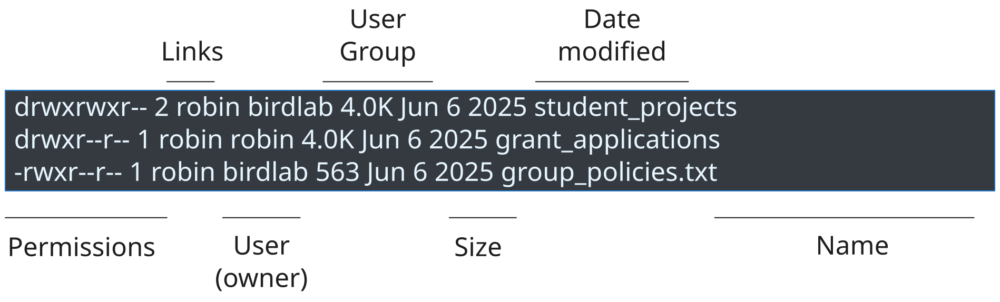

# File Permissions

:::{.callout-tip}
### Learning Objectives

- Describe how Unix determines file ownership and access permissions.
- Interpret the permissions listed in the `ls -l` output and explain what they allow.
- Use `chmod`, `chgrp`, and `chown` to change access and ownership to files and directories.
:::

## Who owns a file?

When you list files with `ls -l`, you see important information about **who owns a file** and **who can view or modify it**.

File ownership and access control should be considered at two levels:

- Who is the individual user who owns it?
- Which groups of users can access it?

On Unix systems, every user belongs to one or more groups, which allows flexible access control across different files and directories.
For example, a shared directory in a research group might be accessible to all group members, whilst a restricted directory might be accessible only to external collaborators.

Two special groups are worth noting:

- **Private primary group**: every user belongs to a private group with the same name as their username.
  This is a placeholder group for the user alone.
- **`sudo` group**: users who can execute administrative commands belong to this group.

To see which groups you belong to, use:

```bash
groups
```

```output
participant sudo users
```

The `ls -l` output shows both the file owner and the group associated with it.
Consider this example:



- All the files and directories belong to the user `robin`, giving them full control over their access permissions.
- The directory `student_projects` and the file `group_policies.txt` belong to a group called `birdlab`.
  Members of this group can have specific access permissions to these items.
- The directory `grant_applications` belongs to the private `robin` group.
  Other users can only access it if `robin` sets permissions for all users.

Now we can consider what permissions control access to files.

::: {.callout-note collapse=true}
#### The `root` user

On Unix systems, files and directories with restricted access are often owned by a special user called `root`.
These are typically essential system files and directories, for example, files containing system-wide software installations or important system configuration.

Trying to access a protected directory typically results in an error:

```bash
ls -l /root
```

```output
"/root": Permission denied (os error 13)
```

Examining the root directory (`ls -l /`) shows very restrictive permissions:

```
drwx------   6 root root       4096 Mar 23 14:47 root
```

To access files or run commands owned by `root`, you must belong to the special `sudo` group.
This group membership allows you to run commands as `root` with unrestricted access by prepending them with the `sudo` command.

For example:

```bash
sudo ls /root/
```

This prompts for your password, then runs successfully (assuming you belong to `sudo`).
:::

## Permissions: read, write, execute

At the beginning of each `ls -l` output, a series of characters indicates the **type of file** and the **permissions** associated with it.

These characters split into four parts:

```
       permissions
    _________________
d    rwx    rwx    rwx
|     |      |      |
|     |      |      Other users
|     |      Group
|     User
Type
of file
```

The first character indicates the file type:

- `d` → a directory
- `-` → a regular file
- `l` → a symbolic link

The next nine characters represent permissions, organised into three groups of three.
Each group applies to a different set of users:

- Characters 1--3: your (owner's) permissions
- Characters 4--6: permissions for users in the group
- Characters 7--9: permissions for all other users

Each group of three characters indicates:

- `r` → **read** permission: you can see the file/directory contents or copy the file
- `w` → **write** permission: you can modify the file, or create files in a directory
- `x` → **execute** permission: you can run the file as a program; for directories, this lets you change into them with `cd`

A `-` in any position means that permission is not granted.

Consider this example:

```
drwxrwxr--  2  robin  birdlab  4.0K  Jun 6 2025  student_projects
drwxr--r--  1  robin  robin    4.0K  Jun 6 2025  grant_applications
-rwxr--r--  1  robin  birdlab  563   Jun 6 2025  group_policies.txt
```

**`student_projects`:**

- The first `d` indicates this is a directory.
- `rwx` (user): `robin` has full read, write, and execute permissions.
- `rwx` (group): members of `birdlab` can read, write to, and access the directory.
  They can inspect files, modify them, delete them, and create new entries.
- `r--` (other): other users can see the directory exists but cannot access it (without `x`, they cannot `cd` into it).

**`grant_applications`:**

- This is a directory associated with Robin's private group, so only Robin can access or modify it.

**`group_policies.txt`:**

- This is a regular file.
- `rwx` (user): `robin` has full permissions.
- `r--` (group and other): members of `birdlab` and other users have read-only access.

::: {.callout-important}
#### Permissions within directories

Directory permissions are separate from the permissions of files within them.
Consider this example of a directory structure with their permissions, owner, and group:

```
student_projects    rwxrwx--- robin birdlab
├── project_a       rwxrwxr-- robin teamA
│  └── TODO.txt     rw-r--r-- robin teamA
└── project_b       rwxrwxr-- robin teamB
```

- Members of `birdlab` can access `student_projects` because they have `rwx` permissions, and they can see both project folders because they have read (`r`) permission.
- However, the permissions of each project directory determine who can access its contents.
  `project_a` is owned by `robin` with group `teamA`, so only `teamA` members can access it.
  The same applies to `project_b` with `teamB`.
- Within `project_a`, the `TODO.txt` file has `rw-r--r--` permissions, so only Robin can modify it; others can only read it.
:::

## Changing permissions: `chmod`

To change file permissions, use the `chmod` command.
Two notations are available: numeric coding and symbolic notation.

The **numeric coding** system maps numbers to permission combinations:

  | Number | Permissions                |
  | -----: | :------------------------- |
  |      7 | `rwx` read, write, execute |
  |      6 | `rw-` read, write          |
  |      5 | `r-x` read, execute        |
  |      4 | `r--` read only            |
  |      3 | `-wx` write, execute       |
  |      2 | `-w-` write only           |
  |      1 | `--x` execute only         |
  |      0 | `---` no permissions       |

For example:

```bash
chmod 660 README.txt
```

assigns read and write permissions to both the user and group (two 6s), and no permissions to others (0).

The **symbolic notation** is easier to remember when modifying a single permission:

- `chmod u+w some_file.txt` → add write to user
- `chmod g-w some_file.txt` → remove write from group
- `chmod o-rwx some_file.txt` → remove all permissions from others
- `chmod a+r some_file.txt` → add read to all users

::: {.callout-important}
#### Recursive directory permissions

When changing directory permissions, consider whether you want to apply the changes **recursively** to all files and directories within it.
To do so, use the `-R` option.

When using symbolic notation recursively, consider the special uppercase `X` execution symbol.
This symbol grants execute permission to directories (so users can `cd` into them), but avoids granting execute to regular files unless they already had it.

To give a group read and write access to all contents in a directory, use:

```bash
chmod -R g+rwX folder_name
```

This ensures directories are executable (accessible) but regular files are not unnecessarily marked as executable.
:::

## Changing groups: `chgrp`

You can change the group a file belongs to using the `chgrp` command with this syntax:

```bash
chgrp <group_name> <file or directory name>
```

Using the earlier example, if Robin wanted to give postdocs access to the `grant_applications` folder, and a `postdocs` group already existed, they could run:

```bash
# Change the group associated with the folder
chgrp -R postdocs grant_applications

# Add read, write and execute permissions
chmod -R g+rwX grant_applications
```

The `-R` option applies the group assignment recursively to all files and directories within the target.
The uppercase `X` in `chmod` ensures that directories receive execute permissions (so users can access them), whilst regular files do not.

::: {.callout-note}
#### Creating groups and assigning users

Only users with `sudo` permissions can create or modify groups.

- To create a new group: `sudo groupadd group_name`
- To add a user to a group: `sudo usermod -aG group_name username`
:::

## Changing ownership: `chown`

Only the `root` user (via `sudo`) can change file ownership.
Even if you own a file, you cannot change its ownership without root privileges.

Use `chown` with these common patterns:

- `sudo chown new_user README.txt` → the file is now owned by `new_user`; the group remains unchanged
- `sudo chown new_user:new_group README.txt` → the file is now owned by `new_user` and assigned to `new_group`
- `sudo chown -R new_user project` → the directory and all its contents are now owned by `new_user` (the `-R` option applies the change recursively)

## Exercises

::: {.callout-exercise}


(**Note:** this is a conceptual exercise, you don't need to use your own terminal.)

Tux ([the Linux mascot](https://en.wikipedia.org/wiki/Tux_(mascot))) has joined a data science project where they will contribute some new code to the group.
On a shared filesystem, the user `tux` can find the following files and directories:

```
drwxrwx---  6  robin  ornithology  4096  Jul  2 2025  source
drwxr-xr-x  2  robin  ornithology  4096  Jul  2 2025  documentation
-rw-rw----  1  robin  ornithology  5321  Jul  2 2025  config.txt
-rwxr-x---  1  robin  ornithology  9216  Jul  3 2025  analyse_data
-rw-r-----  1  wren   ornithology  1488  Jul  3 2025  TODO.txt
-r--r-----  1  robin  ornithology   743  Jul  4 2025  version.txt
```

Answer the following questions:

1. How many regular files and directories are shown in this listing and how can you tell them apart?
2. How can `tux` check if they belong to the `ornithology` group?
3. Assuming they do, can they make contributions to the project's `documentation` folder?
4. Which directory do you think they should primarily work from to contribute to this project?
5. Who can modify the `version.txt` file?
6. Is there anything that other users (not in the `ornithology` group) can see in this filesystem?

::::: {.callout-answer}
1. Based on the first character of each line, there are two directories (`source` and `documentation`) and four regular files.
   The file `analyse_data` has no extension but has execute (`x`) permissions, suggesting it is a program for running the entire analysis.
2. Tux can use the `groups` command to check their group membership.
3. No.
   The group has `r-x` permissions on `documentation`, so tux can list its contents and access files within it (subject to those files' own permissions), but cannot create, delete, rename, or modify directory entries.
4. The `source` directory is where tux should primarily work, because the `ornithology` group has write permissions (`rwx`) on it.
5. The `version.txt` file is read-only for both the owner and group.
   This suggests Robin wants to prevent accidental changes to this file, though they could modify permissions if needed.
6. Yes.
   The `documentation` directory has `r-x` permissions for other users, so those outside the `ornithology` group can see inside it.
   However, their access to specific files and subdirectories depends on their individual permissions.
:::::
:::

::: {.callout-exercise}


(**Note:** this is a conceptual exercise, you don't need to use your own terminal.)

Continuing from the previous exercise, with this hypothetical filesystem:

```
drwxrwx---  6  robin  ornithology  4096  Jul  2 2025  source
drwxr-xr-x  2  robin  ornithology  4096  Jul  2 2025  documentation
-rw-rw----  1  robin  ornithology  5321  Jul  2 2025  config.txt
-rwxr-x---  1  robin  ornithology  9216  Jul  3 2025  analyse_data
-rw-r-----  1  wren   ornithology  1488  Jul  3 2025  TODO.txt
-r--r-----  1  robin  ornithology   743  Jul  4 2025  version.txt
```

Answer the following questions:

1. How could `robin` add write permissions to the `version.txt` file only to themselves?
2. What permissions would `analyse_data` have after running `chmod 774 analyse_data`?
3. How could `robin` make `documentation` only accessible to themselves?

::::: {.callout-answer}
1. To add write permissions to the file: `chmod u+w version.txt`
2. Running `chmod 774 analyse_data` results in permissions `rwxrwxr--`:
   - Owner: read, write, execute
   - Group: read, write, execute
   - Others: read-only
3. They could use `chmod 700 documentation` to set permissions to `rwx------`, making the directory accessible only to themselves.
:::::
:::

::: {.callout-exercise}


(**Note:** this is a conceptual exercise, you don't need to use your own terminal.)

Take the following example we saw earlier, illustrating a directory structure with different permissions set for different groups of users:

```
student_projects    rwxrwx--- robin birdlab
├── project_a       rwxrwxr-- robin teamA
│  └── TODO.txt     rw-r--r-- robin teamA
└── project_b       rwxrwxr-- robin teamB
```

What commands could `robin` run to ensure that all members of the `birdlab` group could read and modify all the files within `student_projects`?

::::: {.callout-answer}
Robin needs to run two commands: one to change the group, and another to change permissions.

This command:

```bash
chgrp -R birdlab student_projects
```

changes the group recursively, so every directory and file within `student_projects` is assigned to the `birdlab` group.

This command:

```bash
chmod -R g+rwX student_projects
```

changes permissions recursively for the group.
The uppercase `X` is important: it grants `rwx` to directories (so users can `cd` into them) and `rw-` to regular files by default (or `rwx` if they already had execute permissions).
:::::
:::

## Summary

:::{.callout-tip}
### Key Points

- File permissions determine who can read, write, or execute a file or directory. The output of `ls -l` displays this information:
  - The first character in `ls -l` indicates the file type.
  - The next nine characters are grouped into owner, group, and other permissions.
  - `r`, `w`, and `x` represent read, write, and execute access.

- Ownership and groups control access on shared systems.
  - `ls -l` shows the owner and associated group.
  - `groups` shows which groups your user belongs to.
  - Shared projects often rely on group-based permissions.

- Some useful commands to manage access and ownership are:
  - `chmod` changes permissions with symbolic or numeric notation.
  - `chgrp` changes the group associated with a file or directory.
  - `chown` changes the owner, but requires `sudo`.
:::
