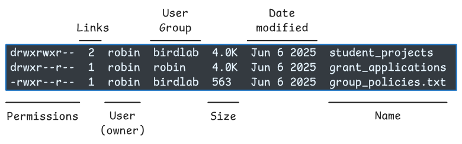

# File Permissions

::: {.callout-tip}
## Learning Objectives

- TODO
:::

## Who owns a file?

When you list files with `ls -l` there is important information about **who owns a file** and **who can view or modify it**.

The ownership and visibility of of a file needs to be considered at two levels:

- Who is the individual user who owns it?
- Which groups of users can potentially access it?

On Unix systems, every user belongs to one or more groups.
This allows flexibility in providing tiers of access to different files/folders.
For example, you may have a shared directory within a research group that all members of the group can see.
And a more restricted directory that external collaborators can access.

There are three special groups worth being aware of:

- **Private primary group**: every user belongs to a private group, which has the same name as their username.
  This is more of a placeholder group, as only the user themselves belongs to it.
- **`sudo` (root)**: users that have permissions to execute administrative commands belong to this group.

You can see which groups you belong to using:

```bash
groups
```

```output
participant sudo users
```

The output from `ls -l` provides information both about the owner of a file and the group that the file belongs to.
Take the following hypothetical example:



- All theses files and directories belong to the user `robin`.
- The directory `student_projects` belongs to a group called `birdlab`, so members of that group can access this directory.
- The other directory and file belong to the private `robin` group, so only the user `robin` themselves can access them.

With the knowledge of who owns a file, let's now consider which permissions are possible to access those files.

::: {.callout-note collapse=true}
#### The `root` user

On Unix systems, files and directories with restricted access are owned by a special user called `root`.
These are often essential system files and directories, for example containing system-wide software installs or other important system configuration files.

For example, trying to access the following protected directory will result in an error:

```bash
ls -l /root
```

```output
"/root": Permission denied (os error 13)
```

If we examine the root directory where this is located (`ls -l /`), we will see its permissions are very restrictive:

```
drwx------   6 root root       4096 Mar 23 14:47 root
```

To be able to run commands or access files owned by `root` you need to be part of the special group called `sudo`.
Belonging to that group means you can run commands as if you were `root`, i.e. with unrestricted access.

On the terminal, you can run commands as `root` by prepending them with the command `sudo`.
For example:

```bash
sudo ls /root/
```

Will prompt for your password, and then should run successfully (assuming you belong to `sudo`).
:::

## Permissions: read, write, execute

In the output of `ls -l` there is a series of characters at the beginning of each line.
These refer to the **type of file** and the **permissions** associated with it.

The characters can be split into four parts:

```
        permissions
     _________________
d    rwx    rwx    rwx
|     |      |      |
|     |      |      All users
|     |      Group
|     User
Type
of file
```

The first character indicates the type of file:

- `d` indicates a directory
- `-` indicates a regular file
- `l` indicates a symbolic link (more on this later)

The next nine characters are the permissions associated with each file or directory.
These are organised in groups of three, each group referring to a different set of users:

- Characters 1-3 refer to your own permissions
- Characters 4-6 are the permissions of users in the group associated with the file/directory
- Characters 7-9 are the permissions for all other users that have an account on the machine

Each group includes three characters, indicating the following permissions in order:

- `r` **read** permission: user can see the contents of the file/directory, or make copies of it.
- `w` **write** permission: user can modify the content of the file or, in the case of a directory, create files within it.
- `x` **execute** permission: user can directly execute and run a file as a program.
  For directories, it means the user can change into this directory with `cd`.

The symbol `-` indicates that the respective permission is not available.
Let's take the same hypothetical example as before:

```
drwxrwxr--  2  robin  birdlab  4.0K  Jun 6 2025  student_projects
drwxr--r--  1  robin  robin    4.0K  Jun 6 2025  grant_applications
-rwxr--r--  1  robin  birdlab  563   Jun 6 2025  group_policies.txt
```

- `student_projects`:
  - The first character, `d`, indicates this is a directory.
  - The following three characters - `rwx` - indicates that user (and owner) `robin` has full read, write, execute permissions to their files and directories.
  - The next three characters - `rwx` - indicates that the group `birdlab` has read and write permissions to this directory.
    This means that they can inspect the content of files within it (read permissions), but also modify them, delete them, or create new files and directories within it.
  - The final three characters - `r--` - indicate that all other users with access to this storage will be able to see the directory name, but will not be able to access it (without execute permission, `x`, the users will not be able to `cd` into it).

- `grant_applications`:
  - This is also a directory, indicated by `d`
  - This directory is only associated with the private user group, `robin`, therefore only the user `robin` themselves can access or modify these files.

- `group_policies.txt`:
  - This is a regular file, indicated by the first `-`
  - As before, the user `robin` has full permissions to this file.
  - The group `birdlab` as well as any other user have read permissions only, indicated by `r--`

::: {.callout-important}
#### Permissions within directories

The permissions to a directory are distinct from the permissions of files and directories *within* it.
Take the following schematic example of a directory and its contents, with their permissions, owner and group highlighted on the right:

```
student_projects    rwxrwx--- robin birdlab
├── project_a       rwxrwxr-- robin teamA
│  └── TODO.txt     rw-r--r-- robin teamA
└── project_b       rwxrwxr-- robin teamB
```

- The top-level directory, `student_projects` can be accessed by members of `birdlab` because they have `rwx` permissions.
- Inside it, users can see both project folders because they have read (`r`) permissions.
- However permissions of each project directory determine who can access its contents.
  In this case, `project_a` is owned by `robin` and its group is `teamA` - so only members of this group can acess it (`rwx`).
  Similarly, for `project_b` only members of `teamB` will be able to access the contents of that directory.
- Finally, within `project_a` the `TODO.txt` file has `rw-r--r--` permissions, meaning only the owner `robin` can modify it, while others can only read it.
:::

## Changing permissions: `chmod`

To change the permissions to a file, we can use the command `chmod`.
There are different types of syntax that can be used to assign permissions with this command, and we'll cover a couple of these.

The first syntax notation uses a **numeric coding** with numbers mapped to different combinations of permissions:

  | number | Permissions                |
  | -----: | :------------------------- |
  |      7 | `rwx` read, write, execute |
  |      6 | `rw-` read, write          |
  |      5 | `r-x` read, execute        |
  |      4 | `r--` read only            |
  |      3 | `-wx` write, execute       |
  |      2 | `-w-` write only           |
  |      1 | `--x` execute only         |
  |      0 | `---` none                 |

For example:

```bash
chmod 660 README.txt
```

Would assign:

- Read and write permissions to the user (first 6) and the group (second 6)
- No permissions at all to everyone else (last 0)

There is also an alternative symbolic notation, which can be easier to memorise to modify a single permission.
There are plenty of details of this symbolic notation on [`chmod`'s Wikipedia page](https://en.wikipedia.org/wiki/Chmod), so we only give a few examples:

- `chmod u+w some_file.txt` → modify user permissions (`u`) by adding (`+`) write permissions (`w`)
- `chmod g-w some_file.txt` → modify group permissions (`g`) by removing (`-`) write permissions (`w`)
- `chmod a-rwx some_file.txt` → modify permissions to other users (`a`) by removing `-` read, write and execute permissions (`rwx`)

::: {.callout-important}
#### Recursive directory permissions

Often, when changing the permissions of a directory, it's important to consider whether you want to change the permissions **recursively for all files and directories inside it**.
If that is the intention (which it often is), then there's two things to consider:

- Add the `-R` option, which will apply the permissions recursively
- Consider using the symbolic notation with the special uppercase `X` execution symbol.
  This symbol ensures that all directories will get execute permissions (so users can `cd` into them), but it won't apply execute permissions to regular files (unless they already have it).

In short, to give read and write permissions to all the contents in a directory, use:

```bash
chmod g+rwX folder_name
```
:::

## Changing groups: `chgrp`

You can change the group that a file belongs to using the `chgrp` command.
The syntax is:

```bash
chgrp   <group_name>   <file or directory name>
```

Taking the same example as before:

```
drwxrwxr--  2  robin  birdlab  4.0K  Jun 6 2025  student_projects
drwxr--r--  1  robin  robin    4.0K  Jun 6 2025  grant_applications
-rwxr--r--  1  robin  birdlab  563   Jun 6 2025  group_policies.txt
```

Let's say that Robin wanted to give postdocs access to the `grant_applications` folder.
Ahead of time, they had created a user group called `postdocs`, so they could give them access with:

```bash
# Change the group associated with the folder
chgrp -R postdocs grant_applications

# Add read, write and execute permissions
chmod -R g+rwX grant_applications
```

Two things of note:

- Similarly to the note above about `chmod`, the `chgrp` option also has a `-R` option, allowing to apply the group association recursively to all files and folders within the target folder.
- Note how we use the uppercase `X` with `chmod`, to ensure directories are given execute permissions, but regular files do not.

::: {.callout-note}
#### Creating groups and assigning users

Only users with `sudo` permissions can create or modify groups.

- To create a new group: `sudo groupadd group_name`
- To add a user to a group: `sudo usermod -aG group_name username`
:::

## Changing ownership: `chown`

Finally, the ownership of a file can also be changed with the `chown` command.
However, an important caveat is that **only the `root` user (via `sudo`) can change file ownership**.
Even if you are the owner of a file, you cannot change its ownership without `root` privelege.

If you do have those permissions though, here are some examples of common use cases:

- `sudo chown new_user README.txt` → the file `README.txt` is now owned by `new_user`; the associated group remains unchanged.
- `sudo chown new_user:new_group README.txt` → the file `README.txt` is now owned by `new_user` and assigned to `new_group`.
- `sudo chown -R new_user project` → the directory `project` is now owned by `new_user`, along with all of its contents (i.e. the change is applied recursively, with `-R`).

## Exercises

::: {.callout-exercise}


(**Note:** this is a conceptual exercise, you don't need to use your own terminal.)

Tux ([the Linux mascot](https://en.wikipedia.org/wiki/Tux_(mascot))) has joined a data science project where they will contribute some new code to the group.
On a shared filesystem, the user `tux` can find the following files and directories:

```
drwxrwx---  6  robin  ornithology  4096  Jul  2 2025  source
drwxr-xr-x  2  robin  ornithology  4096  Jul  2 2025  documentation
-rw-rw----  1  robin  ornithology  5321  Jul  2 2025  config.txt
-rwxr-x---  1  robin  ornithology  9216  Jul  3 2025  analyse_data
-rw-r-----  1  wren   ornithology  1488  Jul  3 2025  TODO.txt
-r--r-----  1  robin  ornithology   743  Jul  4 2025  version.txt
```

Answer the following questions:

1. How many regular files and directories are shown in this listing and how can you tell them apart?
2. How can `tux` check if they belong to the `ornithology` group?
3. Assuming they do, can they make contributions to the project's `documentation` folder?
4. Which directory do you think they should primarily work from to contribute to this project?
5. Who can modify the `version.txt` file?
6. Is there anything that other users (not in the `ornithology` group) can see in this filesystem?

::::: {.callout-answer}
1. Based on the first character of each line, we can infer there are two directories (`source` and `documentation`) and all others are regular files.
   Somewhat non-intuitive is the fact that `analyse_data` has no extension, but the fact it has execute (`x`) permissions suggests it is a program used to run the entire analysis.
2. To check which groups they are a part of, `tux` can use the `groups` command.
3. No.
   The group has `r-x` permissions on documentation, so if tux is in `ornithology`, they can list the directory's contents and access files within it (subject to those files' own permissions), but they cannot create, delete, rename, or modify directory entries.
4. The `source` directory is the most likely place for Tux to contribute code, based on the fact that the `ornithology` group has write permissions on it (`rwx`).
5. The `version.txt` file has very restrictive permissions, being read-only to both the owner (`robin`) and the group.
   This is strange, but it suggests `robin` wants to ensure no changes happen to this file even by accident.
   However, `robin` could change the permissions of the file in the future if they wanted to make changes.
6. Yes.
   The `documentation` has `r-x` permissions for other users, so even those not in `ornithology` can see inside it.
   However, remember that what users can actually see within the folder depends on the permissions of files and directories within it.
:::::
:::

::: {.callout-exercise}


(**Note:** this is a conceptual exercise, you don't need to use your own terminal.)

Continuing from the previous exercise, with this hypothetical filesystem:

```
drwxrwx---  6  robin  ornithology  4096  Jul  2 2025  source
drwxr-xr-x  2  robin  ornithology  4096  Jul  2 2025  documentation
-rw-rw----  1  robin  ornithology  5321  Jul  2 2025  config.txt
-rwxr-x---  1  robin  ornithology  9216  Jul  3 2025  analyse_data
-rw-r-----  1  wren   ornithology  1488  Jul  3 2025  TODO.txt
-r--r-----  1  robin  ornithology   743  Jul  4 2025  version.txt
```

Answer the following questions:

1. How could `robin` add write permissions to the `version.txt` file only to themselves?
2. What permissions would `analyse_data` have after running `chmod 774 analyse_data`?
3. How could `robin` make `documentation` only accessible to themselves?

::::: {.callout-answer}
1. To add write permissions to the file: `chmod u+w version.txt`
2. Running `chmod 774 analyse_data` would result in the following permissions: `rwxrwxr--`.
   This means:
   1. Owner: read, write, execute
   2. Group: read, write, execute
   3. Others: read-only
3. They could change the permissions to `rwx------` with `chmod 700 documentation`
:::::
:::

::: {.callout-exercise}


(**Note:** this is a conceptual exercise, you don't need to use your own terminal.)

Take the following example we saw earlier, illustrating a directory structure with different permissions set for different groups of users:

```
student_projects    rwxrwx--- robin birdlab
├── project_a       rwxrwxr-- robin teamA
│  └── TODO.txt     rw-r--r-- robin teamA
└── project_b       rwxrwxr-- robin teamB
```

What commands could `robin` run to ensure that all members of the `birdlab` group could read and modify all the files within `student_projects`?

::::: {.callout-answer}
The user `robin` would have to run two commands: one to change the group, another to change permissions.

This command:

```bash
chgrp -R birdlab student_projects
```

would change the group **recursively**, so that every directory and file within `student_projects` will be assigned to the `birdlab` group.

This command:

```bash
chmod -R g+rwX student_projects
```

would change file and directory permissions **recursively** to the group (`g+`).
The use of the uppercase `X` is important, and specifies the following:

- Directories will have `rwx` permissions - remember, the execute permission is important for directories, otherwise users are not able to `cd` into them.
- Files will have `rw-` permissions (i.e. not executable by default), unless they already had execute an permission, in which case they will get `rwx`.
:::::
:::

## Summary

::: {.callout-tip}
#### Key points

- TODO
:::
